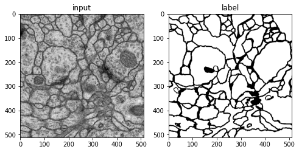
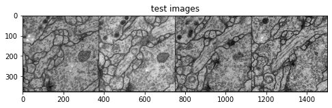
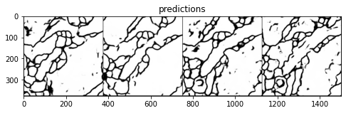

# U-Net implementation using PyTorch on Google Colab

We implement the well-known image segmentatation architecture, [U-Net](https://arxiv.org/abs/1505.04597) for segmentation of neural structures in electron microscopic stacks.
Because [the segmentation challenge website](brainiac2.mit.edu/isbi_challenge/) indicated in [the authors' website](https://lmb.informatik.uni-freiburg.de/people/ronneber/u-net/)
is (apparently) no longer accessible, we use the datasets (i.e., `volumes-train.tif`, `labels-train.tif`, `volumes-test.tif`) shared in [the repository](https://github.com/zhixuhao/unet/tree/master/data/membrane).

Our U-Net architecture is inspired by the Coursera course [Apply GANs](https://www.coursera.org/learn/apply-generative-adversarial-networks-gans/home/week/2).

---

## Requirements
This repository is designed to train the model and make inferences entirely on Google Colab. So, for successful training and inference, it suffices to

- open the notebook [`unet_cell_data.ipynb`](https://github.com/byrkbrk/unet-implementation/blob/22248e94a769afd2894ad695b7c64d89cfaaeadc/unet_cell_data.ipynb) 
on Colab (by using either this [link](https://colab.research.google.com/github/byrkbrk/unet-implementation/blob/main/unet_cell_data.ipynb) or the link *Open in Colab* at the top left of the notebook)
- sign in your Google account (if you haven't yet)
- run the cells (having short explanatory comments) one by one

## Training dataset

Our training dataset consists of 30 input-label image pairs (i.e., `volumes-train.tif`, `labels-train.tif`) and one example of them is as follows:

## Test dataset and predictions

In like manner, our test dataset (viz., `volumes-test.tif`) comprises a total of 30 images. Presented below are certain exemplars drawn from the test dataset, together with the corresponding predictions (of our trained U-Net):

